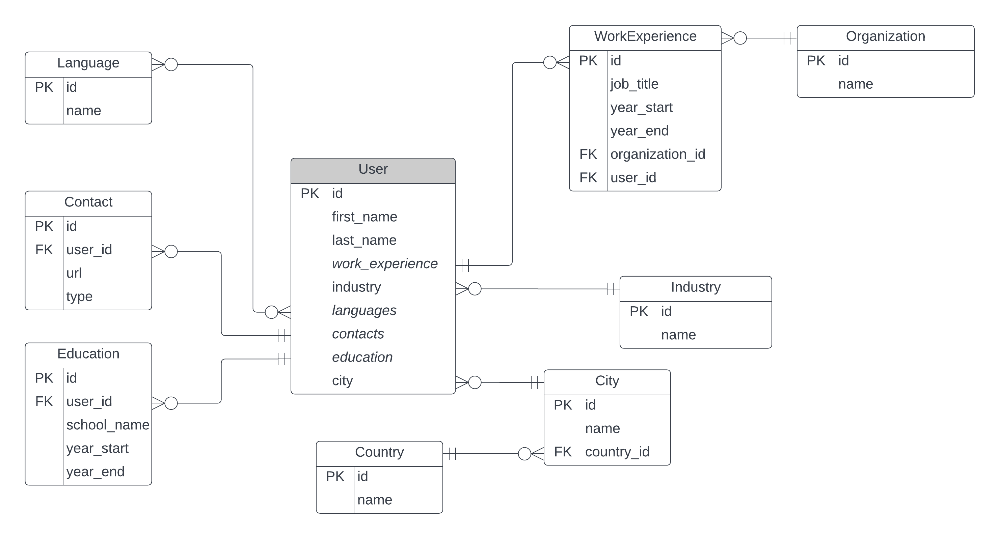

# PostgreSQL CV Setup

## ER Diagram

## Resources:
- [FastAPI SQL Integration](https://fastapi.tiangolo.com/tutorial/sql-databases/)
- [SQLAlchemy UNIQUE constraint](https://docs.sqlalchemy.org/en/14/core/constraints.html#unique-constraint)
- [SQLAlchemy Basic Relationship Patterns](https://docs.sqlalchemy.org/en/14/orm/basic_relationships.html)
- [Faker: creating data](https://faker.readthedocs.io/en/stable/index.html)